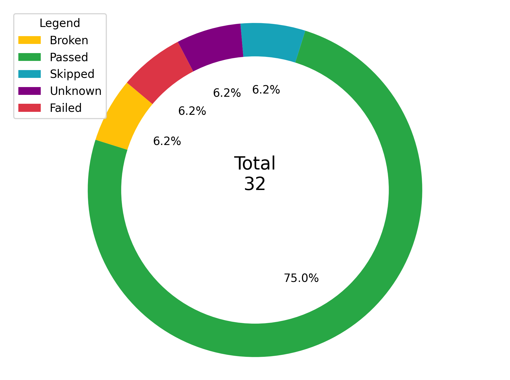

# Python allure notifications 
The project is a simple implementation of generating an allure report in the form of a pie chart and sending it to a telegram chat using telegram API. The report contains the statistics of test runs, such as the number of passed, failed, skipped, unknown, and broken tests.

## Getting Started
These instructions will get you a copy of the project up and running on your local machine for development and testing purposes.

## Prerequisites
What you need to install the software and how to install them:

Python

Matplotlib

Requests

## Installation
A step by step series of examples that tell you how to get a development environment running:

Clone the repository:
`git clone https://github.com/danilashkerdin/python-allure-notifications.git
`

Navigate to the project folder:
`cd python-allure-notifications
`

Install the dependencies:
`pip install -r requirements.txt
`

Usage
An example of how to run the code:

`
python main.py --token [BOT_TOKEN] --chat [CHAT_ID] --path [IMAGE_PATH]
`

## License
This project is licensed under the MIT License.